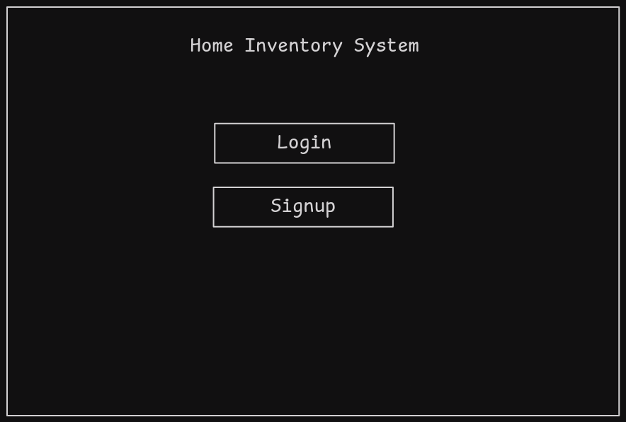
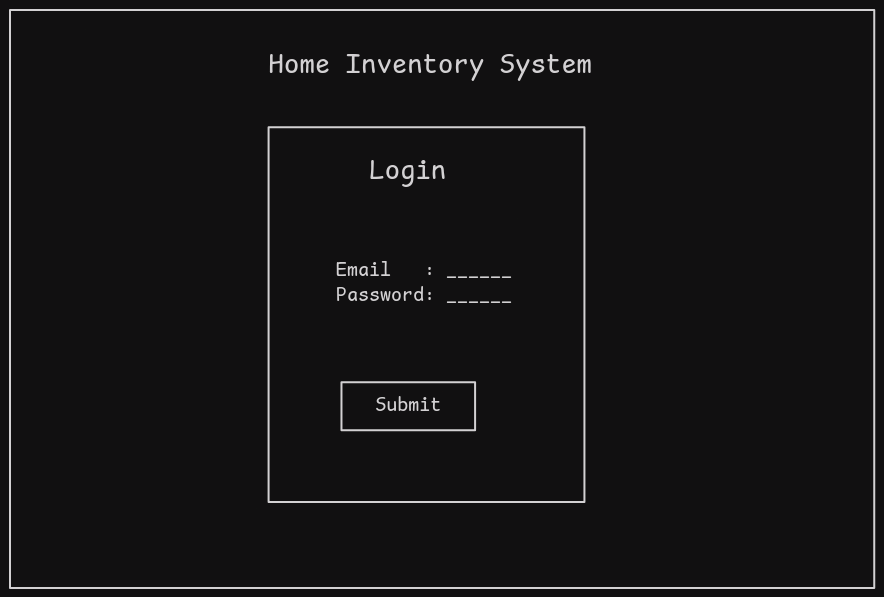
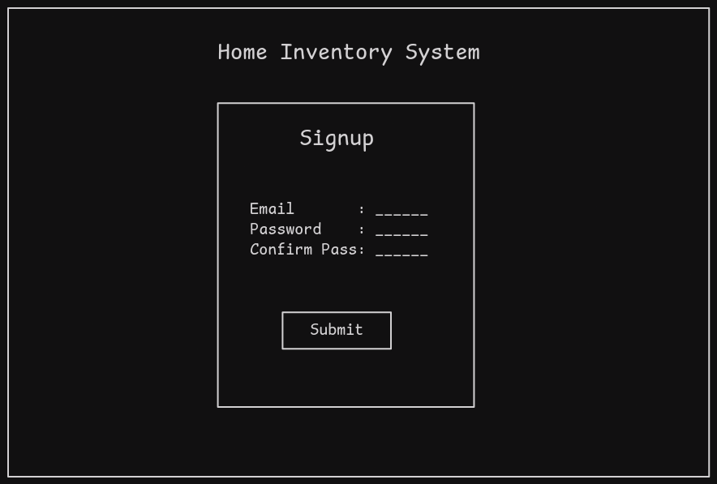
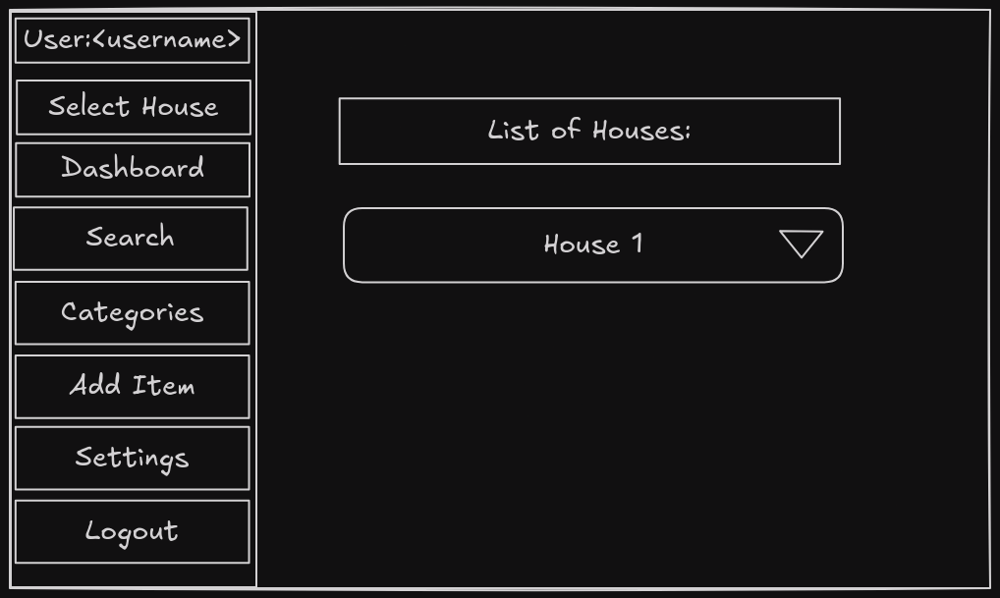

# Home Inventory Manager

# Overview

A digital platform enabling users to catalog, organize, and manage household items with detailed descriptions, photos, and searchable inventory for easy tracking and access.

# Objective

Provide a centralized system to digitally catalog items with photos, descriptions, and categories, streamlining inventory management, reducing clutter, and simplifying retrieval for daily use or emergencies.

It is useful for people renting out houses with furniture already in-place , this serves as a remainder and evidence for future use for disputes and insurance claims

# Project Workflow

- Login / Signup
- Select house
- Dashboard of overall items
- Search
- Browse by category
- Add item
- Generate Reports in PDF or CSV format
- Settings
- Create Backups
- Logout

# Tech Stack

- Frontend: React
- Backend: Go
- Database: Mongodb

# Wireframe diagrams

## Landing Page

## Login Page

## Signup page

## List Houses

